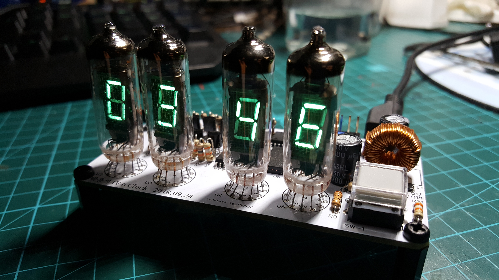

IV-6 VFD Clock design based on attiny4313.

2018.9.24 ~ 2018.10.16

Software, schemetic, PCB file created by PARK JONG SEOK (박종석)

NO LICENCE INCLUDED
Contact cakeng@naver.com to
use, modify, or share the software, schemetic, PCB for any purpose
other than personal use.

PCB/Schematic at https://easyeda.com/cakeng/iv8-clock.

//EDIT

Currently updating the system to use the newly released Attiny816. (2018.11.28)

Code is for attiny4313. PCB is using Attiny816.
